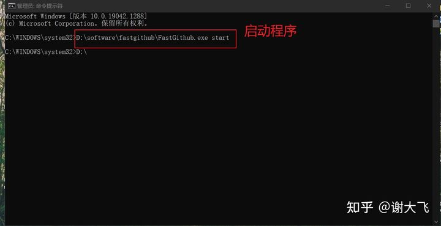

# FastGithub下载及使用 #

**GitHub访问问题**

很多需要用到的脚本及软件会先发布在GitHub上，所以经常需要访问GitHub，但是每次都会卡在跳转到GitHub的步骤，就是还没开始就可以结束了。


之前尝试过手动修改host文件来解决网站的访问问题 以及更换网络但还是有时候无法如愿的访问GitHub

**FastGithub 介绍**

终于有一天我和大佬（一个超厉害的老师）抱怨无法正常访问GitHub的时候，大佬指着屏幕上的fast GitHub和我说试试这个


真是不试不知道 有一试吓一跳！

FastGithub是一个开源的软件主要为了使GitHub畅通无阻，有超大量的IP资源、快速的IP检测功能，以及微小的宽带占用，智能的DNS设置，并且支持多平台和加速GitHub的其它域名

**FastGithub 下载**

源代码是发布在GitHub上的，但是当我们无法正常访问GitHub的时候可以先下载发布在gitee上的旧版本，等能正常访问GitHub的时候再下载使用最新的版本


下载到指定的位置，我是下载到了D盘里面防止C盘内存不够

**安装及使用**

下载下来的是个zip的压缩包，解压缩之后找到.exe的运行程序，双击运行程序


然后以管理员的身份运行cmd，输入运行FastGithub的命令即可运行 D:\software\fastgithub_win-x64是你将fast GitHub下载存放的位置

```
D:\software\fastgithub_win-x64\FastGithub.exe start    #启动fast GitHub

D:\software\fastgithub_win-x64\FastGithub.exe stop      #停止fast GitHub
```



启动之后fast GitHub会自动更改你的dns


然后就可以顺畅无阻的访问GitHub啦！


在每次访问GitHub之前记得要先保证FastGithub在运行的状态

**安装GitHub上FastGithub的最新版本**

当GitHub能正常跳转之后我们就可以下载安装GitHub上的FastGitHub的最新版本


安装和使用都和旧版本一致哦

**Linux下FastGithub及使用**

我竟然忘记了服务器上面下载GitHub上的数据也是慢的离谱，所以呢需要下载linux上的FastGithub来进行加速


**下载和安装FastGithub**

```
yum install libicu    #先下载依赖包

wget -c https://github.com/dotnetcore/FastGithub/releases/download/2.0.4/fastgithub_linux-x64.zip    # 下载FastGithub
 
unzip fastgithub_linux-x64.zip    #解压

cd fastgithub_linux-x64    #进入到FastGithub文件夹下

./fastgithub    #运行FastGithub
```


下载依赖包


下载FastGithub并解压


运行FastGithub

**下载GitHub上的内容**

因为当直接运行fast GitHub的时候会停在这个界面，下载东西不方便所以考虑将其直接挂载载后台运行，然后访问下载Github上的内容

```
nohup ./fastgithub 2>&1 &    #将程序挂载后台运行且不输出日志文件

wget -c https://github.com/tanghaibao/goatools/blob/main/data/association.txt
# 测试下载速度
```


将FastGithub挂载后台运行


正常速度下载文件

**参考文章**

[让GitHub畅通无阻](https://link.zhihu.com/?target=https%3A//www.cnblogs.com/kewei/archive/2021/06/21/14913063.html)

编辑于 11-03

参考链接：https://zhuanlan.zhihu.com/p/428454772